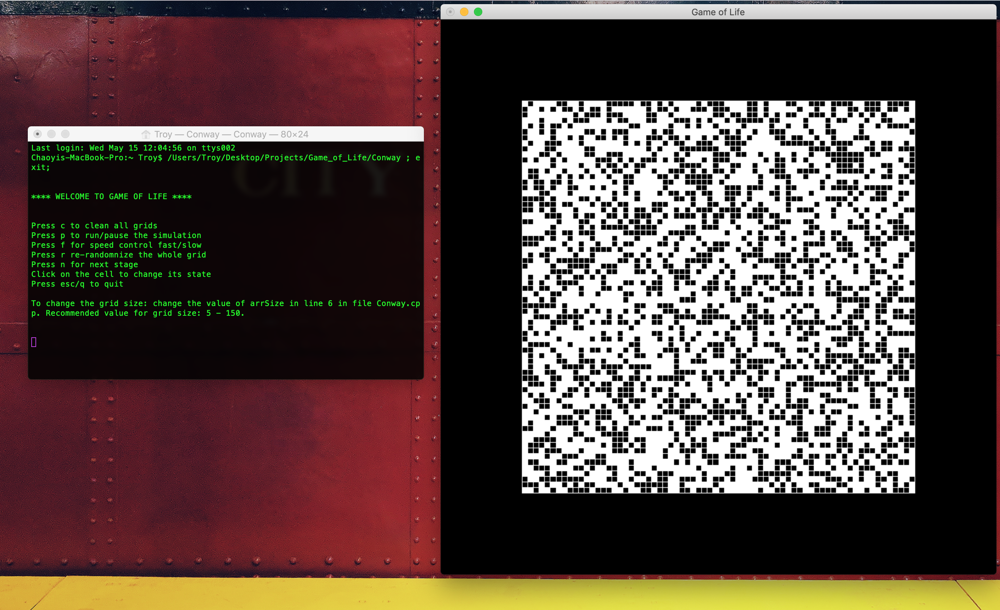

## WELCOME TO GAME OF LIFE 

### Run
In CLI `make` which generates the executable `Conway`

### Controls
- Press c to clean all grids
- Press p to run/pause the simulation
- Press f for speed control fast/slow
- Press r re-randomnize the whole grid
- Press n for next stage
- Click on the cell to change its state 
- Press esc/q to quit